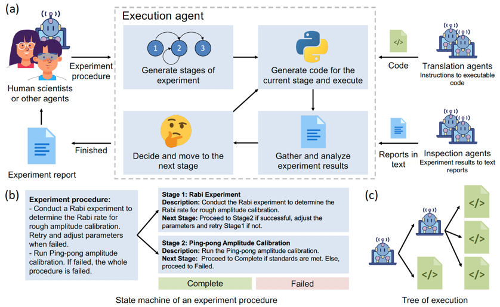

# k_agents

Knowledge agents for lab automation.
> The project is still under construction! Star us to see when it is finished.



## Why k-agents

**Motivation**

Laboratory automation is important for the efficiency of scientific discovery.
However, it is hard to transfer laboratory knowledge to AI.

**Our solution**

- We provide user-friendly interfaces to inject laboratory knowledge into AI.
- The injected knowledge is wrapped into LLM-based knowledge agents.
- Execution agents use the knowledge agents to automate laboratory procedures.

## Supported knowledge types

Here we show how the users can inject knowledge into the AI.

### Actions that can be done by code

```python
from k_agents.experiment import Experiment
class SomeActionInLab(Experiment):
    def run(self):
        # do something in the lab
        ...
```

### Complicated experimental procedures

```markdown
# Experiment 1
## Steps
1. Do experiment A. If failed, go to step 3.
2. Do experiment B. If failed, try again.
3. Do experiment C. If failed, the procedure is failed.
```

### How to analyze experiment proces

```python
class SomeActionInLab(Experiment):
    @visual_inspection("""
    If there is a clear peak in the figure, the experiment is successful.
    Else, the experiment is failed.
    """)
    def function_that_make_plot(self):
        # produce a figure
        return fig

    @text_insepction
    def function_that_produces_a_report(self):
        # produce a report
        report = "The experiment is successful."
        return report

```


# Examples

We have applied this framework to calibrate quantum computers!

More examples of usage available at https://github.com/ShuxiangCao/LeeQ/tree/k_agents/leeq/experiments/builtin/basic/calibrations