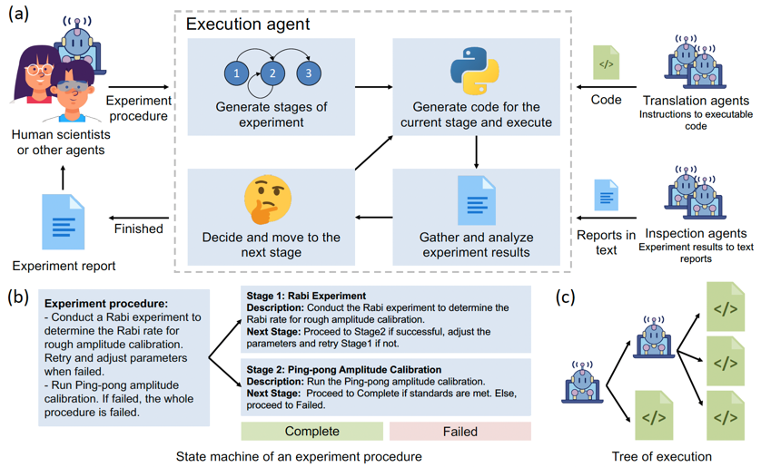

# k-agents

> **This project has fulfilled its mission.** If you are interested in this work,
> please visit [NVIDIA's Quantum Calibration Agent Blueprint](https://github.com/NVIDIA/Quantum-Calibration-Agent-Blueprint/).

Knowledge agents for lab automation.




Paper: [arXiv:2412.07978](https://arxiv.org/abs/2412.07978)

## Installation and development

The project uses Python 3.11 or later. Install
[uv](https://docs.astral.sh/uv/getting-started/installation/), then sync
the locked Python environment:

```sh
uv sync --locked --extra app
uv run --locked kaleido_get_chrome
uv run --locked --extra app streamlit run application/example_lab/example_app.py
```

The default text and vision LLM is `gpt-5.6-luna`. Set `OPENAI_API_KEY` in
your environment or enter it in the app. Embeddings retain their separate model.
You can override `mllm.config.default_models` after importing `k_agents`.

To run the LeeQ simulation:

```sh
uv sync --locked --extra leeq
uv run --locked --extra leeq streamlit run application/leeq/leeq_app.py
```

Dependencies are declared in `pyproject.toml` and pinned in `uv.lock`. Use
`uv add` to add dependencies and `uv lock --upgrade` to update the lockfile.
Run the image export regression tests with `uv run --locked pytest -q`
after installing Chrome.

## Deployment

The Docker image uses `uv sync --locked --extra leeq --no-dev` and includes
Chromium for Kaleido's Plotly image export. The build runs an actual image export
so a missing or unusable browser fails the build before deployment. Outside
Docker, install Chrome with `uv run --locked kaleido_get_chrome`, or point
`BROWSER_PATH` at an existing compatible browser.

```sh
docker build -t k-agents .
docker run --rm -p 8080:8080 --env OPENAI_API_KEY k-agents
```

The app listens on `PORT` (default `8080`). Its health endpoint is `/_stcore/health`.

## Why k-agents

**Motivation**

Laboratory automation is important for the efficiency of scientific discovery.
However, it is hard to transfer laboratory knowledge to AI.

**Our solution**

- We provide user-friendly interfaces to inject laboratory knowledge into AI.
- The injected knowledge is wrapped into LLM-based knowledge agents.
- Execution agents use the knowledge agents to automate laboratory procedures.

## Supported knowledge types

Here we show how the users can inject knowledge into the AI.

### Actions that can be done by code

```python
from k_agents.experiment import Experiment
class SomeActionInLab(Experiment):
    def run(self):
        """
        documenation of the experiment
        """
        # do something in the lab
        ...
```

### Complicated experimental procedures

```markdown
# Experiment 1
## Steps
1. Do experiment A. If failed, go to step 3.
2. Do experiment B. If failed, try again.
3. Do experiment C. If failed, the procedure is failed.
```

### How to analyze experiment proces

```python
class SomeActionInLab(Experiment):
    @visual_inspection("""
    If there is a clear peak in the figure, the experiment is successful.
    Else, the experiment is failed.
    """)
    def function_that_make_plot(self):
        # produce a figure
        return fig

    @text_insepction
    def function_that_produces_a_report(self):
        # produce a report
        report = "The experiment is successful."
        return report

```

# Application to superconducting qubit calibration

The k-agents framework has been applied to calibrate superconducting quantum gates

## Indexing experiments

Experiments:

https://github.com/ShuxiangCao/LeeQ/tree/k_agents/leeq/experiments/builtin/basic/calibrations

Procedures:

https://github.com/ShuxiangCao/LeeQ/tree/main/leeq/experiments/procedures


## Notebook for calibration (tune-up)

https://github.com/ShuxiangCao/LeeQ/blob/main/notebooks/Agent/SingleQubitTuneUp.ipynb

https://github.com/ShuxiangCao/LeeQ/blob/main/notebooks/Agent/TwoQubitTuneUp.ipynb
